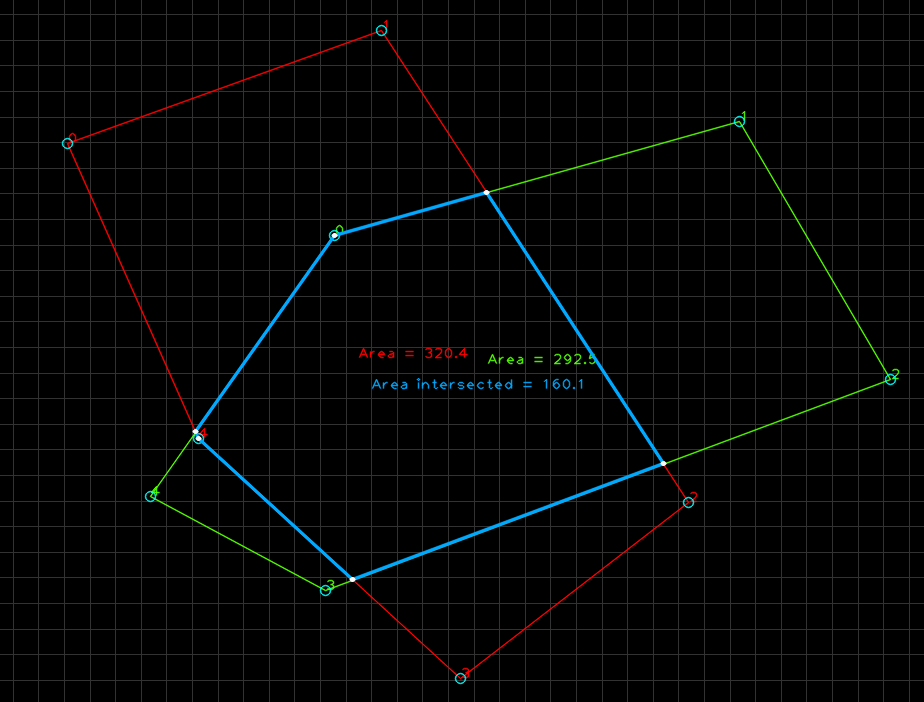

# convex polygon-intersection
Simple algo to find convex polygon intersection and compute area of polygone with using OpenCV 

####1. Prepare the OpenCV environment####

#####Linux#####

[Install Opencv2.2 in Ubuntu 11.04](http://www.samontab.com/web/2011/06/installing-opencv-2-2-in-ubuntu-11-04/)

[Install OpenCV 2.4.1 in Ubuntu 12.04 LTS](http://www.samontab.com/web/2012/06/installing-opencv-2-4-1-ubuntu-12-04-lts/)

#####Mac#####

[Install the OpenCV library on Mac OS X Lion using Homebrew](http://craiccomputing.blogspot.tw/2012/08/installing-opencv-library-on-mac-os-x.html)

#####Windows#####

Edit CMakeLists.txt and modify the path to your opencv path line 5 for to find OpenCVConfig.cmake file.

####2. Prepare the CMake build environment####

	$ sudo apt-get install cmake

####3. Clone the project to local####

	$ git clone https://github.com/abreheret/polygon-intersection.git

####4. Take out-of-source CMake build####

	$ mkdir release
	$ cd release
	$ cmake ..
	$ make

####5. Run and enjoy####

	$ ./main

####6. Exit####

	Press 'Esc' to close window and quit

####7. Screen ####

